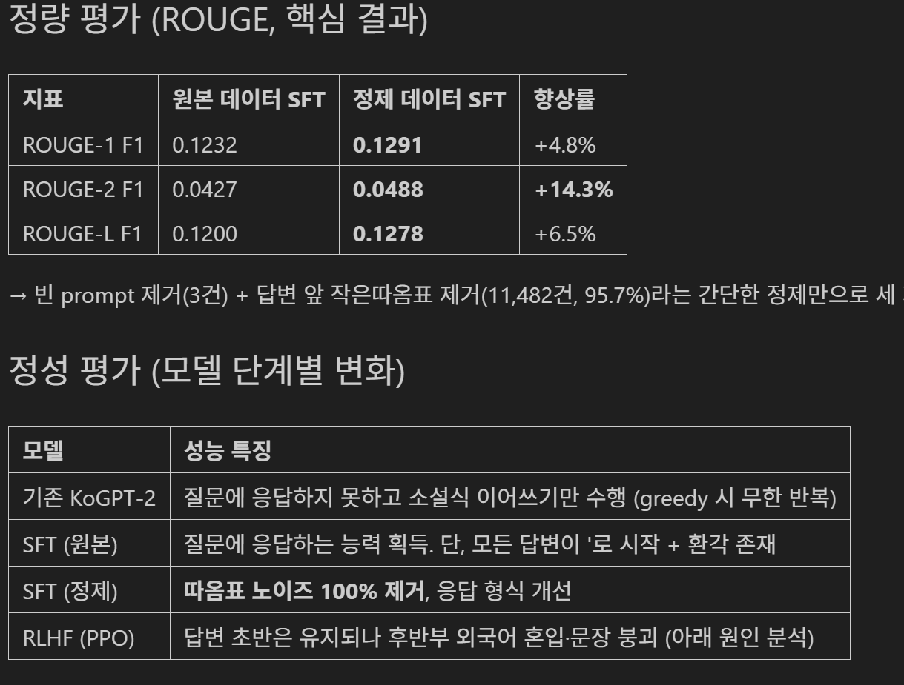
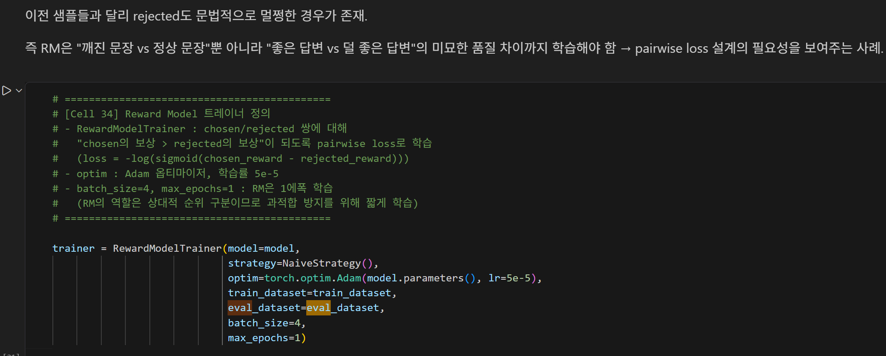
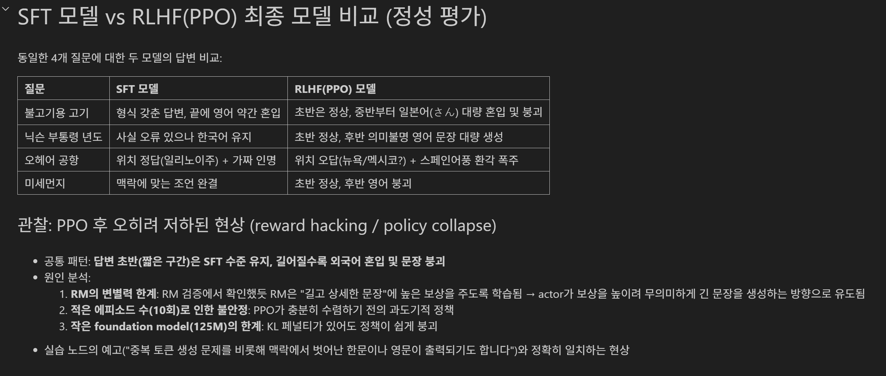
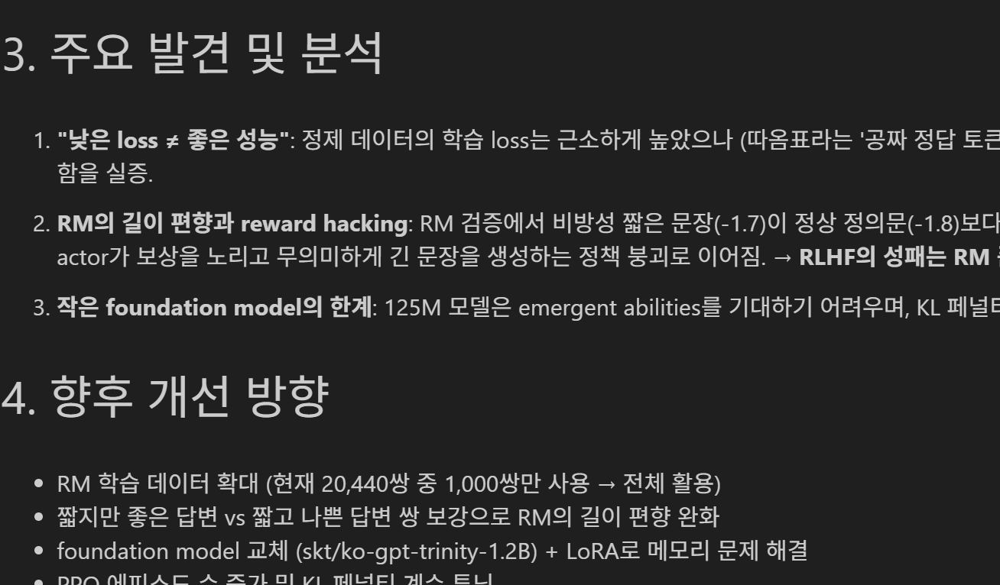

# AIFFEL Campus Online Code Peer Review Templete
- 코더 : 장주휘
- 리뷰어 : 김택훈


# PRT(Peer Review Template)
- [x]  **1. 주어진 문제를 해결하는 완성된 코드가 제출되었나요?**

        

        - 원본과 정제 데이터로 SFT를 재학습한 모델의 ROUGE 정량적/정성적 비교가 충실히 되어 있음 
        - SFT, RM, PPO의 학습 및 평가 결과 시각화
    
- [x]  **2. 전체 코드에서 가장 핵심적이거나 가장 복잡하고 이해하기 어려운 부분에 작성된 

        - 각 코드 셀마다 주석이 달려 있어 읽어보며 흐름을 짚어보기 편했습니다. 
        
        
- [x]  **3. 에러가 난 부분을 디버깅하여 문제를 해결한 기록을 남겼거나
새로운 시도 또는 추가 실험을 수행해봤나요?**

        - 각 부분들마다 결과를 해석하고 원인을 분석하며 기록한 흔적이 있습니다. 
        - 패키지 오류를 해결했던 기록이 있습니다. 
        
        
        
- [x]  **4. 회고를 잘 작성했나요?**

        - 배운 점, 한계, 원인 분석, 향후 개선 방향이 중간중간 그리고 마지막에 구체적으로 기록되어 있습니다. 
        
        
- [x]  **5. 코드가 간결하고 효율적인가요?**


# 회고(참고 링크 및 코드 개선)
```
1. 저는 RM을 위주로 접근해보았는데 이렇게 서로 다른 접근방식에서의 결과를 볼 수 있어 좋았고, 정량적 비교도 충실하여 결과를 파악하기 쉬웠습니다.   
2. dlthon을 비롯한 최근 프로젝트들에서 더더욱 데이터 전처리의 중요성이 많이 부각되고 있다고 느낍니다. 이런 흐름 속에서 비록 '작은' 따옴표 문제였지만 이를 주요 전처리 개선사항으로 캐치하여 ROUGE score에 꽤 큰 향상을 이루어낸 점이 인상깊었습니다.    


```
